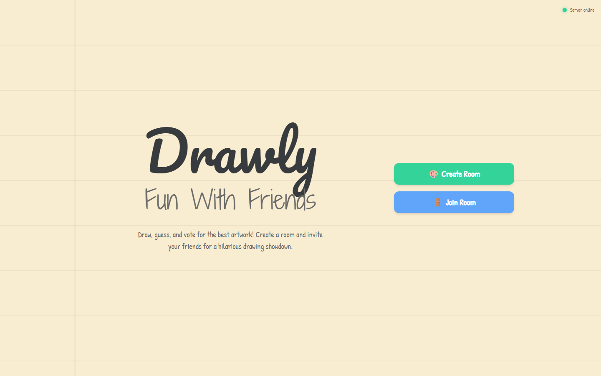
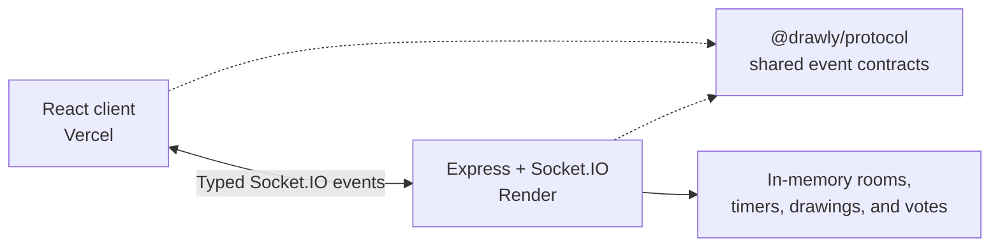

# Drawly

Drawly is a real-time multiplayer drawing game for friends. Create a private
room, write prompts, draw on desktop or mobile, vote anonymously, and share a
branded recap when the game ends.

**[Play Drawly](https://drawly.vercel.app)**



## Highlights

- Private rooms for up to 10 players
- Touch and mouse drawing with colors, brush sizes, eraser, undo, and redo
- Configurable drawing rounds, anonymous voting, scoring, and leaderboards
- Reconnection during active games
- Optional live drawing previews for the prompt author
- Reactions, sound effects, chat, and downloadable drawings
- Locally generated end-of-game recap cards with native sharing where supported
- Keyboard focus, reduced-motion support, timer announcements, and browser zoom

## How a game works

1. A host creates a room and shares its five-character code or invitation URL.
2. Each player submits a drawing prompt.
3. Players draw someone else's prompt while its author watches the round.
4. Everyone votes for a favorite; the prompt author's vote counts twice.
5. Drawly scores the round, advances through every prompt, and publishes the
   final leaderboard and recap.

## Architecture



- `client/` contains the React 19, Vite, Tailwind CSS, and Canvas application.
- `server/` owns room membership, phases, timers, validation, voting, and
  scoring. Clients never authoritatively advance the game.
- `shared/` defines the Socket.IO contract consumed by both TypeScript builds.
- The server validates every inbound payload and enforces connection, event,
  image-size, and room-memory limits.
- Game state is intentionally ephemeral; there is no database or account
  system.

## Local development

Requirements:

- Node.js 20 or newer
- npm 10 or newer

Install each application from the repository root:

```bash
npm install --prefix client
npm install --prefix server
```

Run the server and client in separate terminals:

```bash
npm run dev:server
npm run dev:client
```

The client runs at `http://localhost:3000`, the server at
`http://localhost:3001`, and Vite proxies Socket.IO traffic during development.

Run the automated server suite and production builds:

```bash
npm test --prefix server
npm run build:server
npm run build:client
```

## Browser support

Drawly targets current releases of Chrome, Edge, Firefox, and Safari, including
Chrome on Android and Safari on iOS. Drawing requires pointer or touch input.
The recap can use the operating system's share sheet when Web Share file
support is available; otherwise Drawly downloads a PNG.

JavaScript, Canvas, WebSocket or HTTP long-polling, and session storage must be
available. Private browsing policies that disable session storage may prevent
reconnection.

## Privacy and data retention

- Drawly has no accounts, advertising, analytics, AI provider, or database.
- Nickname, avatar, room code, and a reconnect credential are stored in the
  browser's session storage and disappear when that browser session is closed.
- Prompts, chat, votes, drawings, and live snapshots exist only in the server's
  memory. They are lost whenever the server restarts.
- During drawing rounds, the client sends an updated canvas snapshot when the
  server requests one so the prompt author can see the live preview.
- A disconnected player is retained for 15 seconds to allow reconnection.
  Rooms are deleted when their final player is removed.
- Recap images are assembled locally in the browser and are not uploaded.
- Production traffic is processed by Vercel and Render. Google Fonts receives
  standard network request metadata when its fonts are loaded.

Do not submit confidential, personal, or harmful content as a prompt, chat
message, or drawing.

## Deployment

### Frontend — Vercel

Deploy from the repository root:

- Build command: `npm install --prefix client && npm run build:client`
- Output directory: `client/dist`
- Set `VITE_SERVER_URL` to the public server URL when not using the included
  Vercel rewrite.

### Server — Render

Deploy from the repository root as a Web Service:

- Build command: `npm install --prefix server && npm run build:server`
- Start command: `npm run start --prefix server`
- Set `CLIENT_URL` to the Vercel origin.
- Set `TRUST_PROXY=true` only when Render or another trusted reverse proxy
  overwrites `X-Forwarded-For`. Leave it unset for direct deployments.

The free Render tier may sleep after inactivity, so the first connection can
take longer while the service wakes.

## Troubleshooting

| Problem | What to check |
|---|---|
| The server appears offline | Open the server `/health` endpoint and wait for a sleeping Render instance to wake. |
| A browser cannot join | Confirm the room code, ensure the game is still in the lobby, and verify `CLIENT_URL` allows the deployed client origin. |
| Reconnection fails | Session storage may have been cleared, the 15-second grace period may have expired, or the server may have restarted. |
| Drawing does not respond | Confirm Canvas is supported and use mouse, pen, or touch input. Browser zoom remains available. |
| Sharing opens no share sheet | Use **Save Recap**; file sharing through Web Share is not available in every browser. |
| Local Socket.IO requests fail | Start the server on port 3001 before the Vite client, and verify no other process owns either port. |

## Roadmap

- Configurable Spy Mode with clearer room-level consent
- Inactive-room expiration and stricter long-lived memory budgets
- Shared binary or lower-resolution drawing previews
- Automated deployment and production smoke checks
- Family-safe prompt presets and additional accessible game modes

## License

Drawly is available under the [MIT License](LICENSE).
